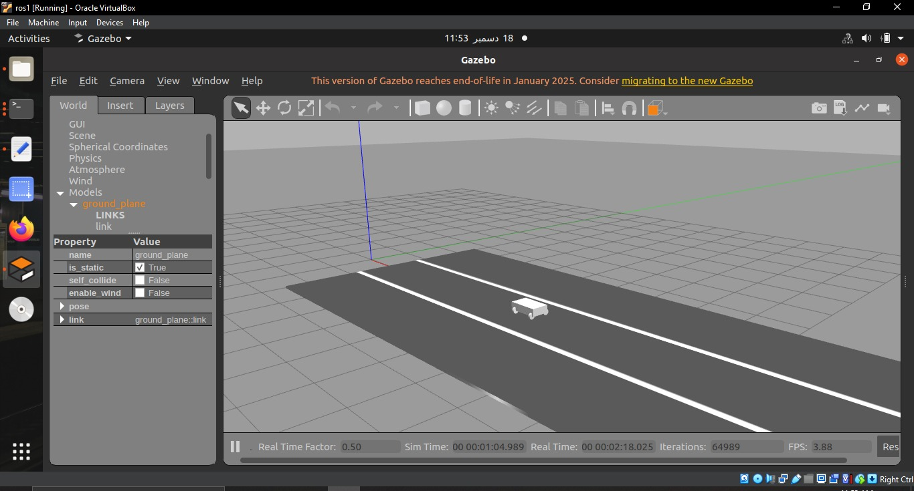
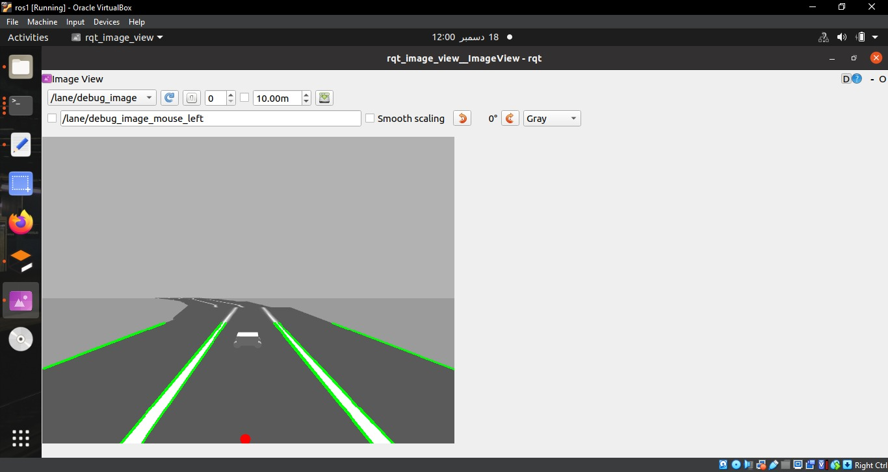
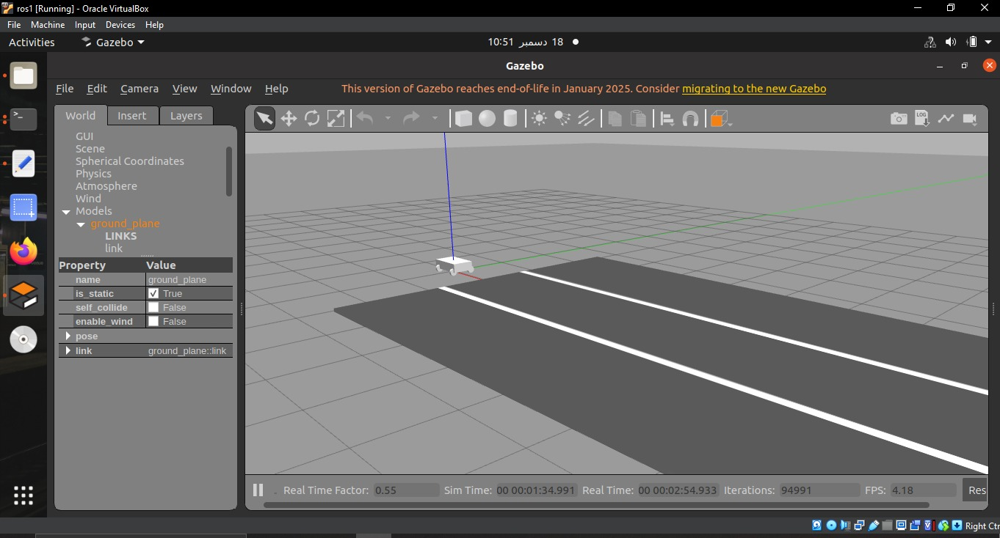

# Lane Assist Robot Simulation

A ROS Noetic and Gazebo-based lane assist simulation for a simple Ackermann-style vehicle. The system uses a front-facing camera, OpenCV lane detection, and feedback control to keep the vehicle aligned with the lane.

## Overview

This project demonstrates a basic autonomous driving pipeline in simulation:

1. A camera publishes road images from the simulated environment.
2. The lane detection node processes the image and estimates the lane center.
3. The controller calculates the error between the lane center and image center.
4. A proportional control command is published to steer the vehicle.
5. The Ackermann bridge converts velocity commands into steering and wheel commands.

## Features

- ROS publisher-subscriber architecture
- Gazebo vehicle and road simulation
- Camera-based lane detection
- OpenCV image processing
- Lane center estimation
- Proportional control with signal smoothing
- Debug image output for visualizing lane detection

## Tools and Technologies

- ROS Noetic
- Gazebo
- Python
- OpenCV
- cv_bridge
- geometry_msgs, sensor_msgs, std_msgs

## Repository Structure

```text
.
├── config/                 # Controller configuration files
├── docs/                   # Project summary and screenshots
├── launch/                 # ROS launch files
├── models/                 # Gazebo SDF models for car, camera, and road
├── scripts/                # Python ROS nodes
├── urdf/                   # Vehicle URDF model
├── CMakeLists.txt
├── package.xml
└── README.md
```

## Main Files

- `scripts/lane_detector.py` — processes camera images and publishes the detected lane target point.
- `scripts/lane_controller.py` — calculates steering commands from lane offset error.
- `scripts/ackermann_bridge.py` — maps `/cmd_vel` commands to vehicle steering and wheel commands.
- `launch/full_system.launch` — starts the complete Gazebo simulation, camera, lane detector, controller, and bridge.

## How to Run

Clone this repository inside the `src` folder of a catkin workspace:

```bash
cd ~/catkin_ws/src
git clone <your-repository-link>
cd ~/catkin_ws
catkin_make
source devel/setup.bash
```

Make sure the Python scripts are executable:

```bash
chmod +x src/lane-assist-robot-simulation/scripts/*.py
```

Run the full simulation:

```bash
roslaunch project full_system.launch
```

View the debug camera output:

```bash
rqt_image_view
```

Select:

```text
/lane/debug_image
```

## Screenshots

### Gazebo Simulation



### Lane Detection Debug View



### Vehicle on Road



## What I Learned

- Building modular ROS nodes
- Using ROS topics for communication
- Processing camera images with OpenCV
- Creating and launching Gazebo simulation models
- Applying proportional control for lane following
- Debugging perception and control behavior in simulation

## Future Improvements

- Add PID control for smoother steering
- Improve lane detection under different lighting conditions
- Add adaptive speed control for curves
- Log tracking error for quantitative performance evaluation
- Test the same architecture on a small physical robot car

## Credits

This was developed as a Robotics Systems and Programming lab project.
